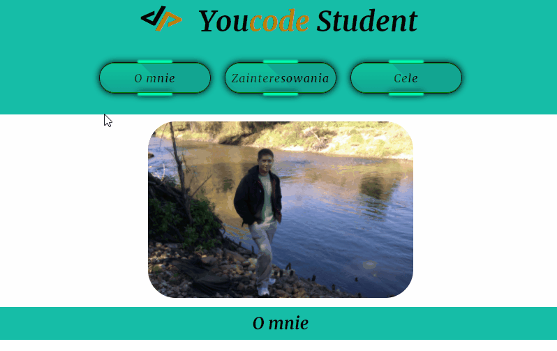
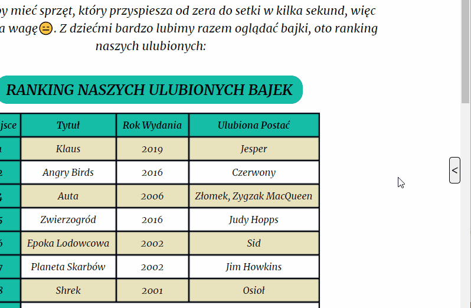
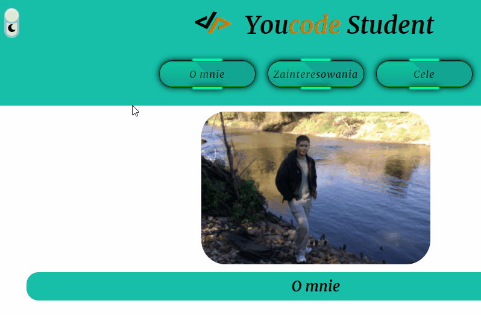

# Homework - My first Page
## Contenins: 
* [Navigation](#Navigation)
* [Aside](#Aside) 
* [Main content](#Main-content)
* [Theme Button](#Theme-Button)
* [Footer](#Footer)
* [Technologies used](#Technologies-used)
* [Site link](#Site-link)

## Navigation

Navigation have 3 buttons witch link us to secions we want jumo to, they made with a litle touch of animation

## Aside

Is small element of my site witch hide and show, on button clicked. button is attached to right side of site, still need few remakes in future

## Main content

Contains general info abount me, showed in articles and tables

## Theme Button

Its button which changing background theme of site do darker, to match the user's preferences

## Footer

last element of site which have contakt information

## Technologies-used

* HTML
* JavaScript
* CSS - modified to BEM convencion
* Git

I used global variables so its easy to chage color of site is style.css file

## Site link
[Take a closer look at the website yourself](https://krzysztof-jaczewski.github.io/Homework/)
